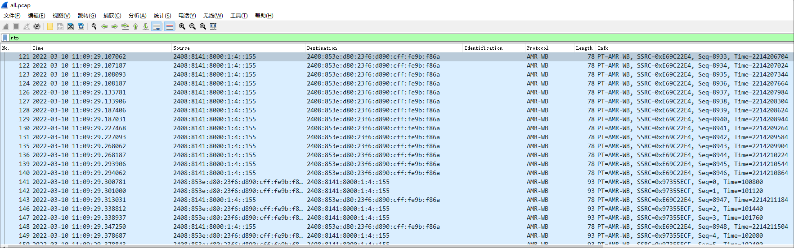
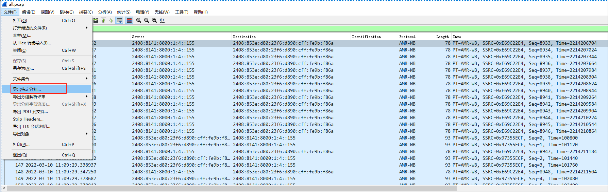
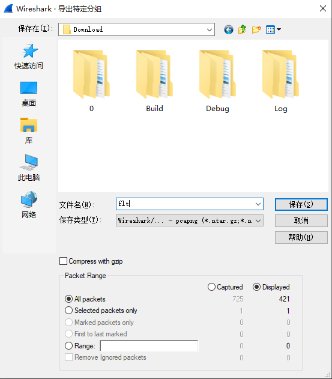
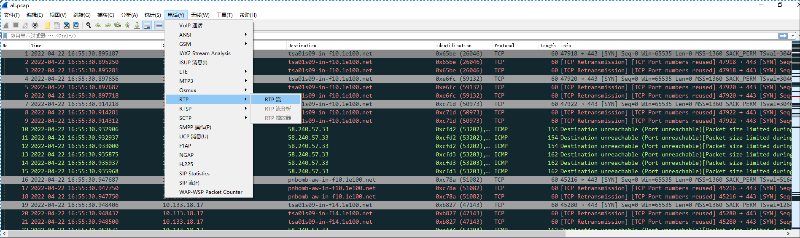
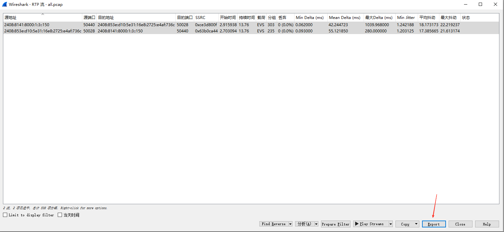
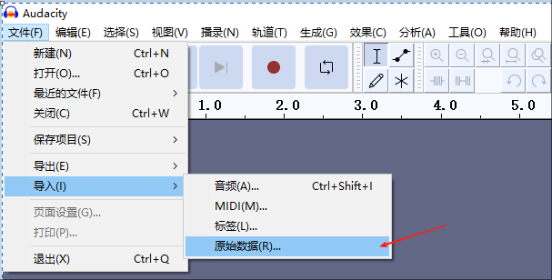
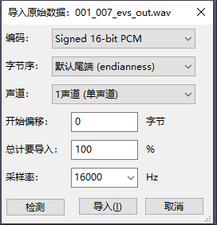
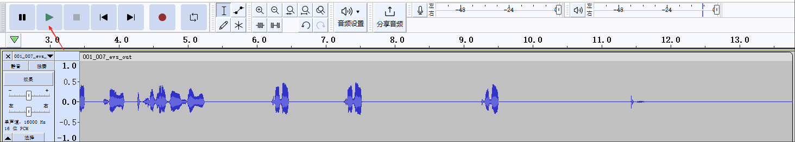

## 1. 得到 tcpdump log

### 1.1 从 QXDM log 中提取出 tcpdump log

### 1.2 将 tcpdump log 合并
```
@echo off

if exist "C:\Program Files\Wireshark" (
   echo "Found Wireshark, please wait Wireshark Wireshark finish..."
   start /wait /b "" "C:\Program Files\Wireshark\mergecap.exe" -w "%cd%\all.pcap" "%cd%"\*.pcap
) else (
   echo "NO Wireshark!"
)

pause
```

## 2. 如果 SDP 中看到通话音频是 AMR/AMR-WB

### 2.1 过滤 RTP, 并将这过滤的特定分组导出




### 2.2 用 python 脚本将过滤的 tcpdump 按 AMR/AMR-WB 解析
* 使用如下项目
  * https://github.com/Spinlogic/AMR-WB_extractor
* 用法
  * python pcap_parser.py -i flt.pcapng -c amr-wb
* 如果依赖报错
    ```
    ModuleNotFoundError: No module named 'scapy'
    pip install scapy

    ModuleNotFoundError: No module named 'bitarray'
    pip install bitarray
    ```

### 2.3 用 potplayer 等播放器播放解析完成后的音频文件
* 可以用附件里的文件试一下
  * [001_001_amr_all.pcap](../file/001_001_amr_all.pcap)
  * [001_002_amr_flt.pcapng](../file/001_002_amr_flt.pcapng)
  * [001_003_amr_out.3ga](../file//001_003_amr_out.3ga)

## 3. 如果 SDP 中看到通话音频是 EVS

### 3.1 用 Wireshark 将 RTP 流导出



### 3.2 用 EVS_dec.exe 解码
* .\EVS_dec.exe -VOIP_hf_only=0 16 .\all.rtpdump out.wav
  * EVS_dec.exe 可以从 3gpp 官网，也可以从 QCAT 中拿到
  * 我们用 rtpdump 的方式，不用 G192
  * 16 从 SDP 中拿到 a=rtpmap:106 EVS/16000/1
* 可以用附件里的文件试一下
  * [001_004_evs_all.pcap](../file/001_004_evs_all.pcap)
  * [001_005_evs_all.rtpdump](../file//001_005_evs_all.rtpdump)
  * [001_006_evs_tool_EVS_dec.exe](../file//001_006_evs_tool_EVS_dec.exe)
  * [001_007_evs_out.wav](../file/001_007_evs_out.wav)

### 3.3 得到 wav 文件后，一般播放器可能无法打开，可以使用 Audacity 试下


