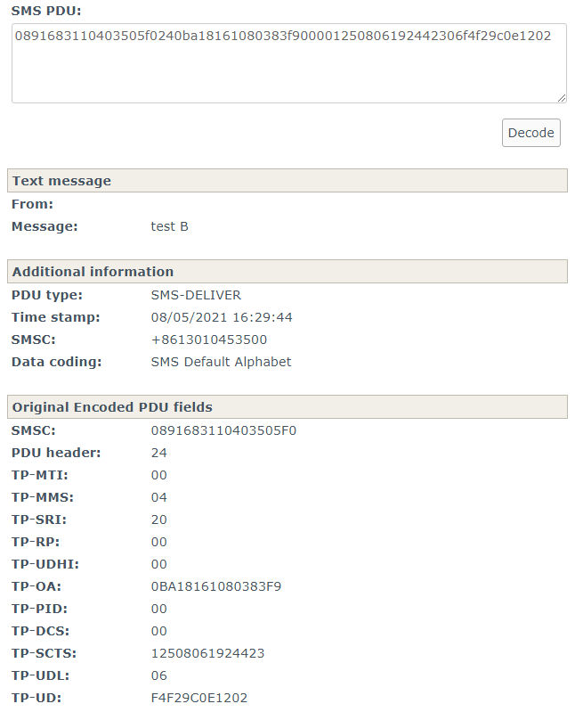
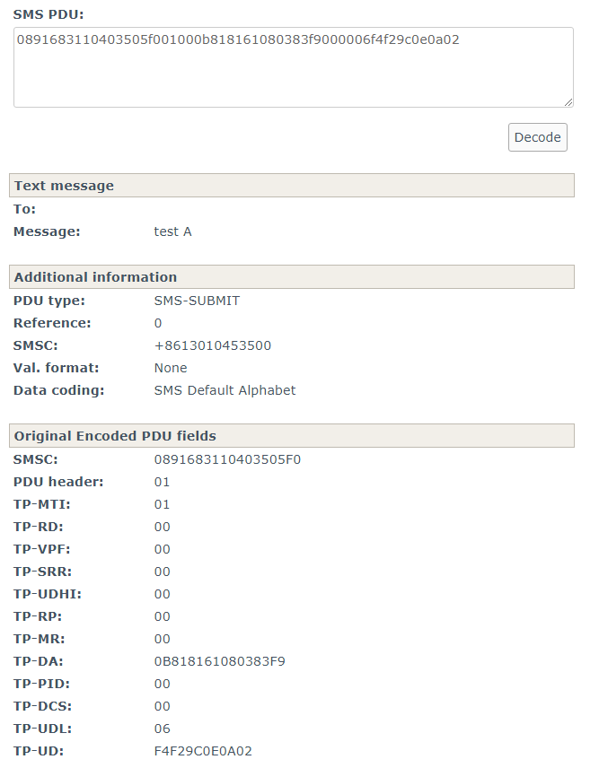

## 1. 介绍
* 本文以实例方式介绍如何从 QMI 和 QCRIL log 中拿到原始 PDU, 然后按照协议解析出内容
* 注: 对于 CS 短信，高通默认 QCRIL log 中不打印 PDU 信息，请从 QMI log 中读取

## 2. 准备知识
* 一般的 PDU 编码由 A B C D E F G H I J K L M 13项组成
    * A: 短信中心地址长度，2 位 16 进制数 (1 字节)
    * B: 短信中心号码类型，2 位 16 进制数
    * C: 短信中心号码，B + C 的长度将由 A 中的数据决定
    * D: 文件头字节，2 位 16 进制数
    * E: 信息类型，2 位 16 进制数
    * F: 被叫号码长度，2 位 16 进制数
    * G: 被叫号码类型，2 位 16 进制数，取值同 B
    * H: 被叫号码，长度由 F 中的数据决定
    * I: 协议标识，2 位 16 进制数
    * J: 数据编码方案，2 位 16 进制数
    * K: 有效期，2 位 16 进制数
    * L: 用户数据长度，2 位 16 进制数
    * M: 用户数据，其长度由 L 中的数据决定
        * J 中设定采用 UCS2 编码，这里是中英文的 Unicode 字符

## 3. 实例讲解
### 3.1 收到 "test B"
#### 3.1.1 QMI log
1. 在 QMI log 中过滤 "wms_set_event_report" 可以看到 modem 报给 AP 短信 (CMAS 等其实也是这条消息) 的全部内容
    ```
    2021 May  8  08:29:46.701  [BA]  0x1544  QMI_MCS_QCSI_PKT
        wms_set_event_report {
            transfer_route_mt_message {
               ack_indicator = WMS_ACK_INDICATOR_SEND_ACK
               transaction_id = 0
               format = WMS_MESSAGE_FORMAT_GW_PP
               len = 25
               data = {
                  36, 11, 161, 129, 97, 8, 3, 131,
                  249, 0, 0, 18, 80, 128, 97, 146,
                  68, 35, 6, 244, 242, 156, 14, 18,
                  2
               }
 
        wms_event_report_indTlvs[1] {
            mt_message_smsc_address {
               len = 8
               data = { 145, 104, 49, 16, 64, 53, 5, 240 }
            }
    ```
2. 这条消息很长，我们只用关注 2 个域，transfer_route_mt_message 和 mt_message_smsc_address，一个是短信全部内容，一个是短信中心地址
    * smsc (B-C):
        * 145, 104, 49, 16, 64, 53, 5, 240
    * message (D-M):
        * 36, 11, 161, 129, 97, 8, 3, 131, 249, 0, 0, 18, 80, 128, 97, 146, 68, 35, 6, 244, 242, 156, 14, 18, 2

3. 所以完整的以 byte 数组形式显示的 PDU 内容为
    * 8, 145, 104, 49, 16, 64, 53, 5, 240, 36, 11, 161, 129, 97, 8, 3, 131, 249, 0, 0, 18, 80, 128, 97, 146, 68, 35, 6, 244, 242, 156, 14, 18, 2
    * 注意补上 A: 短信中心地址长度
    
4. 一般我们解析需要的输入是 16 进制的 string，所以我们要把上面的 byte 数组转换成 16 进制 string，如下就是 Java 代码的一种方案:
    ```
    String txtRaw = "";
    String[] txt = txtRaw.split(", ");
    for (String s: txt) {
        System.out.print(String.format("%02x", Integer.parseInt(s)));
    }
    ```

5. 转换之后我们得到:
    * byte: 8, 145, 104, 49, 16, 64, 53, 5, 240, 36, 11, 161, 129, 97, 8, 3, 131, 249, 0, 0, 18, 80, 128, 97, 146, 68, 35, 6, 244, 242, 156, 14, 18, 2
    * hex:  0891683110403505f0240ba18161080383f900001250806192442306f4f29c0e1202

6. 之后我们就可以拿 16 进制的 string 当输入进行解析，这边提供一个在线网站，省的对照协议解析
    * https://www.diafaan.com/sms-tutorials/gsm-modem-tutorial/online-sms-pdu-decoder/
    * 解析完的结果如下
    * 

#### 3.1.2 QCRIL log
1. 同样的，我们也可以在 QCRIL log 中拿到 PDU, 过滤 "onIncomingImsSms"
    ```
    [63/ 0] MSG 08:29:46.923750 Android QCRIL/Low [DiagLogger.cpp 86] [RILQ] RIL[0][qcril_qmi_ims_radio_service.cpp: 104] [DispatcherModul(1363,1634)] imsRadiolog: < [230/150] onIncomingImsSms: sms = {.format = "3gpp", .pdu = [34]{8, 145, 104, 49, 16, 64, 53, 5, 240, 36, 11, 161, 129, 97, 8, 3, 131, 249, 0, 0, 18, 80, 128, 9
    [63/ 0] MSG 08:29:46.923750 Android QCRIL/Low [DiagLogger.cpp 86] [RILQ] RIL[0][qcril_qmi_ims_radio_service.cpp: 104] [DispatcherModul(1363,1634)] imsRadiolog: < [230/230] 7, 146, 68, 35, 6, 244, 242, 156, 14, 18, 2}, .verstat = STATUS_VALIDATION_NONE}
    ```

### 3.2 发送 "test A"
#### 3.2.1 QCRIL log
1. 按照发送的流程，我们先看 QCRIL 的, 过滤 "sendImsSms|qcril_sms_request_ims_send_sms"
    ```
    [63/ 0] MSG 08:29:31.928750 Android QCRIL/Low [DiagLogger.cpp 86] [RILQ] RIL[0][qcril_qmi_ims_radio_service.cpp: 104] [HwBinder:1363_1(1363,1684)] imsRadiolog: > [180/150] sendImsSms: token=16 imsSms={.messageRef = 0, .format = "3gpp", .smsc = "", .shallRetry = 0, .pdu = [19]{1, 0, 11, 129, 129, 97, 8, 3, 131, 249, 0, 0,
    [63/ 0] MSG 08:29:31.928750 Android QCRIL/Low [DiagLogger.cpp 86] [RILQ] RIL[0][qcril_qmi_ims_radio_service.cpp: 104] [HwBinder:1363_1(1363,1684)] imsRadiolog: > [180/180]  6, 244, 242, 156, 14, 10, 2}}
    [63/ 0] MSG 08:29:31.952500 Android QCRIL/Low [DiagLogger.cpp 86] [QCRIL_SMS] RIL[0][qcril_qmi_sms.cpp: 3825] [DispatcherModul(1363,1634)] qcril_sms_request_ims_send_sms: smsc address , pdu 01000b818161080383f9000006f4f29c0e0a02
    ```

2. 这边 byte 数组和 16 进制 string 的都有打印。但我们发现这边发送短信是不带 smsc 的! 那我们怎么办?

3. 好办，我们可以人为的加一段短信中心的 pdu
    ```
    08 SMSC地址信息的长度 共8个八位字节 (包括91)
    91 SMSC地址格式(TON/NPI) 用国际格式号码 (在前面加‘+’)
    68 31 10 40 35 05 f0 SMSC地址 8613010453500，补 ‘F’ 凑成偶数个
    ```

4. 比如我们加一段 0891683110403505f0, 完整的 16 进制 string 就是
    * 0891683110403505f001000b818161080383f9000006f4f29c0e0a02

5. 接着，我们放进网站中解析
    * 

#### 3.2.2 QMI log
1. 同样的，我们也可以从 QMI log 中拿到 PDU，过滤 "wms_raw_send"
    ```
    2021 May  8  08:29:31.758  [EF]  0x1544  QMI_MCS_QCSI_PKT
      wms_raw_send {
            raw_message_data {
               format = WMS_MESSAGE_FORMAT_GW_PP
               len = 20
               raw_message = {
                  0, 1, 0, 11, 129, 129, 97, 8,
                  3, 131, 249, 0, 0, 6, 244, 242,
                  156, 14, 10, 2
    ```
    * 得到 byte 数组为
        * 0, 1, 0, 11, 129, 129, 97, 8, 3, 131, 249, 0, 0, 6, 244, 242, 156, 14, 10, 2
    * 再转成 16 进制就行

2. 但有没有发现这边的 byte 数组比 QCRIL 中的多一个 byte 0？
    * QMI:
        * 0, 1, 0, 11, 129, 129, 97, 8, 3, 131, 249, 0, 0, 6, 244, 242, 156, 14, 10, 2
    * QCRIL:
        * 1, 0, 11, 129, 129, 97, 8, 3, 131, 249, 0, 0, 6, 244, 242, 156, 14, 10, 2

3. 其实这个 0 就表示 SMSC 的长度为 0, 所以我们人为加 SMSC PDU 的时候记得把第一个 byte 0 去掉
    ```
    qcril_qmi_sms.cpp#qcril_sms_fill_wms_payload
    /* There is no SMSC address.  The first byte of the raw data is the SMSC length, which is 0. */
    ```

### 3.3 有源码的情况
1. 如果有项目源码，可以将 log 中的 PDU 放到源码里，编译 jar 放到手机里进行重放
2. 比如插到 getSlicingConfig@RIL.java，这样进入 4636 工程界面的时候，就会触发一次 这个特定 PDU 构造的短信
    ```
    byte[] pdu = IccUtils.hexStringToBytes("");
 
    SmsMessageBase smsb = com.android.internal.telephony.gsm.SmsMessage.createFromPdu(pdu);
    if (mGsmSmsRegistrant != null) {
        mGsmSmsRegistrant.notifyRegistrant(
                new AsyncResult(null, smsb == null ? null : new SmsMessage(smsb), null));
    }
    ```
