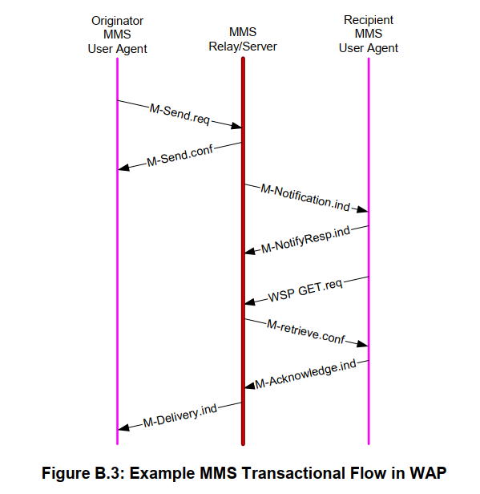
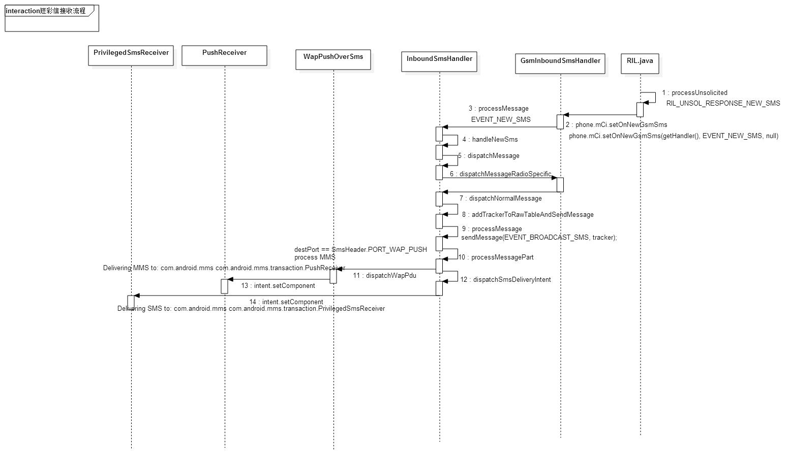

## 1. 收到 M-Notification-ind

```
2021-05-27 18:07:10.085750 2001:4888:2:7124:a0:104:0:23 2600:100c:1219:9863:4044:4eff:fe7b:ff1a MMSE 832
Request: MESSAGE sip:+12064822734@[2600:100c:1219:9863:4044:4eff:fe7b:ff1a]:5060 | MMS m-notification-ind

Wireless Session Protocol, Method: Push (0x06), Content-Type: application/vnd.wap.mms-message
MMS Message Encapsulation, Type: m-notification-ind
  X-Mms-Message-Type: m-notification-ind (0x82)
  X-Mms-Transaction-ID: 05E98714425700001960000101
  X-Mms-MMS-Version: 1.0
  X-Mms-Message-Class: Personal (0x80)
  X-Mms-Message-Size: 30720
  X-Mms-Expiry: 431999.000000000 seconds
  X-Mms-Content-Location: http://69.78.88.102/servlets/mms?message-id=
  From: 7865145824/TYPE=PLMN 
```
* 文件在附件里，可以自行查看
    * [tcpdump](../file/003_001_tcpdump.pcap)

## 2. Telephony Framework 处理
```
05-27 13:06:51.195 3307 3386 I QImsService: ImsSenderRxr : [UNSL]< UNSOL_INCOMING_IMS_SMS[SUB0]
05-27 13:06:51.231 3403 3534 D GsmInboundSmsHandler: destination port: 2948
05-27 13:06:51.530 4406 4447 D WAP PUSH: wpman processMsg 4:application/vnd.wap.mms-message
```
* 引用网上的一张 framework 处理流程图


## 3. Delivery 给 MMS 应用，应用去下载
```
// 1st
05-27 13:06:54.912 3403 26758 D MmsService: [DownloadRequest@c255aad messageId: 0] HTTP: GET [http://69.78.88.102](http://69.78.88.102)[44], PDU size=0
671 2021-05-27 18:07:14.006406 10.150.242.65 69.78.88.102 HTTP 345 GET /servlets/mms?message-id= HTTP/1.1
05-27 13:06:55.034 3403 26758 D MmsService: [DownloadRequest@c255aad messageId: 0] HTTP: 404 Not Found

// 2nd
05-27 13:06:57.068 3403 26758 D MmsService: [DownloadRequest@c255aad messageId: 0] HTTP: GET [http://69.78.88.102](http://69.78.88.102)[44], PDU size=0
690 2021-05-27 18:07:16.145812 10.150.242.65 69.78.88.102 HTTP 345 GET /servlets/mms?message-id= HTTP/1.1
05-27 13:06:57.164 3403 26758 D MmsService: [DownloadRequest@c255aad messageId: 0] HTTP: 404 Not Found

// 3rd
05-27 13:07:01.205 3403 26758 D MmsService: [DownloadRequest@c255aad messageId: 0] HTTP: GET [http://69.78.88.102](http://69.78.88.102)[44], PDU size=0
704 2021-05-27 18:07:20.283312 10.150.242.65 69.78.88.102 HTTP 345 GET /servlets/mms?message-id= HTTP/1.1
05-27 13:07:01.300 3403 26758 D MmsService: [DownloadRequest@c255aad messageId: 0] HTTP: 404 Not Found 
```
* 3 次下载都失败了，都是 404 Not Found 错误
* 404 一般是所请求的资源不存在
* 我们来看下这个 GET URL，比较奇怪的是这个 URL 最后结尾是 message-id=
    * 如果我是服务器，我 TM 也不知道要展示给你什么文件啊

## 4. 这个 GET 的 URL 是怎么生成的呢？
* 其实就是 M-Notification.ind 里的 X-Mms-Content-Location
* 
* 而在 PushReceiver.java 里处理 M-Notification.ind 是有段代码的
    ```
    case MESSAGE_TYPE_NOTIFICATION_IND: {
        NotificationInd nInd = (NotificationInd) pdu;
        if (MmsConfig.getTransIdEnabled()) {
            byte [] contentLocation = nInd.getContentLocation();
            if ('=' == contentLocation[contentLocation.length - 1]) {
                byte [] transactionId = nInd.getTransactionId();
                byte [] contentLocationWithId = new byte [contentLocation.length
                                                        + transactionId.length];
                System.arraycopy(contentLocation, 0, contentLocationWithId,
                        0, contentLocation.length);
                System.arraycopy(transactionId, 0, contentLocationWithId,
                        contentLocation.length, transactionId.length);
                nInd.setContentLocation(contentLocationWithId);
            }
        }
    ```
    * 如果 enable transId, 并且原来的 contentLocation 以 "=" 结尾, 那就加上 X-Mms-Transaction-ID 作为 contentLocation
        * 这个值存在 mmssms.db 的 pdu 表里，后面如果下载就是用的这个地址去下载
    * 正常 GET 的地址就是这样的
        ```
        12157 2021-05-29 15:47:16.445358 10.149.36.56 63.55.224.23 HTTP 392 GET /servlets/mms?message-id=22E9AD5C964700001310000101 HTTP/1.1
        ``` 
    * 而这个 enable transId 可以通过 CarrierConfig 进行启用
        ```
        <boolean name="enabledTransID" value="true" />
        ```

## 5. 其他或者国内运营商没配这个为什么不会有这个问题呢？
* 国内这些运营商的 contentLocation 格式是这样的，没有以 "=" 结尾
    ```
    329 2021-05-29 14:52:41.360442 10.128.27.213 10.0.0.200 HTTP 380 GET http://10.233.232.149:186/WPuPX1 HTTP/1.1
    ```