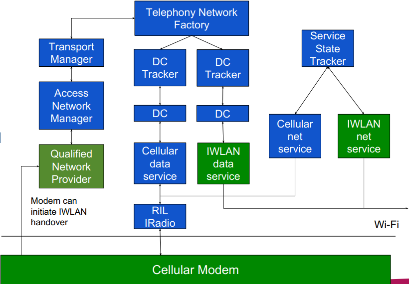

## 1. 先来看我们在新平台 (Android Q 及之后) 遇到的几个问题
#### 1. 为什么 VoWiFi 的时候看不到上层有 IMS 的 SETUP_DATA_CALL?

#### 2. 为什么手机都注册上 VoWiFi 了, DATA_REGISTRATION_STATE 怎么还是报的 LTE?

## 2. 我们先给出上面 2 个问题的简单解释, 然后再来看看新平台究竟做了哪些改动
#### 1. 为什么 VoWiFi 的时候看不到上层有 IMS 的 SETUP_DATA_CALL?
* 新平台 Google 做了 CellularDataService 和 IWlanDataService 的区分, CellularDataService 后面是通过 RIL IRadio 发给 modem，即看到的 SETUP_DATA_CALL
* 而 IWlanDataService 是由 vendor 自己实现的, 各家厂商不一样, 比如高通就实现在 "vendor.qti.iwlan", 并且后面通过 CNE 等发给 modem, 并没有走 RIL IRadio

#### 2. 为什么手机都注册上 VoWiFi 了, DATA_REGISTRATION_STATE 怎么还是报的 LTE?
* 同样的, 新平台有 CellularNetworkService 和 IWlanNetworkService 的区分, IWLAN data 注册状态也不通过 RIL IRadio 上报
* 而是通过 vendor 自己的实现, 高通平台叫 "IWlanNetworkService", DATA_REGISTRATION_STATE 是 RIL 消息, 所以看不到 DATA_REGISTRATION_STATE 里报 IWLAN
* 其实这样也好, 省的之前都通过 RIL 报, 一旦注册上 VoWiFi, DATA_REGISTRATION_STATE 就只有 IWLAN, 都不知道其他 Cellular 的 RAT 情况

## 3. OK, 接下来我们看下新平台, Google 及高通对 IWLAN 做了哪些改动
* 
* 新的架构将 IWLAN 从 Cellular 传输途径中分离了出来
* 从这张图中看, 新架构主要有 2 点变化
    1. IWLAN 由 AP 新增的 data service 和 network service 处理
    2. Data 的 handover 由 qualified networks provider 控制

### 3.1 IWLAN 由 AP 新增的 data service 和 network service 处理
#### 3.1.1 IWLAN 下 IMS data call 怎么建立?
* DCT-I -> DC-I-X -> DSM-I -> IWlanDataService
    * 高通的 IWlanDataService 很多 log 不打印, 需要设置 persist.vendor.iwlan.logging.logcat 为 true
    ```
    05-19 18:36:09.670  2691  2691 D QtiDCT-I: [0]trySetupData for APN type ims, reason: dataEnabled, requestType=NORMAL. Data allowed, reason: NORMAL
    05-19 18:36:09.694  2691  2863 D DC-I-2  : initConnection:  RefCount=1 mApnList={{mApnType=ims mState=CONNECTING mWaitingApns={[[ApnSettingV7] ims
    05-19 18:36:09.840  2691  2855 D DSM-I-0 : onSetupDataCallComplete. resultCode = 0, response = DataCallResponse
    05-19 18:36:09.841  2691  2863 D DC-I-2  : DcActivatingState: msg={what=EVENT_SETUP_DATA_CONNECTION_DONE when=-1ms obj={mTag=28 mApnContext={mApnType=ims
    ```

#### 3.1.2 IWLAN 下 data 注册状态如何上报?
* 可以搜索关键字 "handlePollStateResultMessage"
    ```
    05-19 18:36:11.727  2691  2691 D SST     : [0] handlePollStateResultMessage: PS IWLAN. NetworkRegistrationInfo{ domain=PS transportType=WLAN registrationState=HOME
    05-19 18:36:11.731  2691  2691 D SST     : [0] handlePollStateResultMessage: PS cellular. NetworkRegistrationInfo{ domain=PS transportType=WWAN registrationState=HOME
    05-19 18:36:11.733  2691  2691 D SST     : [0] handlePollStateResultMessage: CS cellular. NetworkRegistrationInfo{ domain=CS transportType=WWAN registrationState=HOME
    ```

#### 3.1.3 上层或者说 APP 侧如何拿到手机是否注册上 IWLAN?
* 还是之前的方法, 是否注册上 VoWiFi 或者 data RAT 是不是 IWLAN, 只不过后者 API 的使用需要换一下
    ```
    ServiceState#getNetworkRegistrationState(DOMAIN_PS, TransportType.WLAN)
    ```

### 3.2 Data 的 handover 由 qualified networks provider 控制
* 我们现在在 Log 中不是经常会看到各种 -C(Cellular), -I(IWLAN) 么? 比如 DCT-C, DCT-I 等, 其实就是这次 redesign 带来的

#### 3.2.1
* 简单来讲就是 TransportManager 有个 APN type 和 transport 的 mapping 表, 用于指示当前每个 APN type 所处的 transport 是 Cellular 还是 IWLAN
* 当 modem 或其他 network provider 说某个 APN type 所处的 transport/prefSystem 变了, 会 QualifiedNetworksService -> AccessNetworkManager -> TransportManager
* 然后 TransportManager 会发起 handover 并维护那个 mapping 表
    ```
    05-19 18:35:59.991  2691  2691 D TransportManager: updateAvailableNetworks: [[QualifiedNetworks: apnType=ims, networks=EUTRAN]]

    dsd_intent_to_change_apn_pref_sys
    apn_pref_sys {
        apn_pref_info {
        apn_name_len = 3
        apn_name = ims
        pref_sys = DSD_APN_PREF_SYS_WLAN
    }

    05-19 18:36:06.109  2691  2691 D TransportManager: updateAvailableNetworks: [[QualifiedNetworks: apnType=ims, networks=IWLAN]]
    ```

#### 3.2.2
* 当 TelephonyNetworkFactory 收到 networkRequest 的时候, 会去 TransportManager 找相应的 transport, 并路由到相应 transport 的处理
    ```
    private void onNeedNetworkFor(Message msg) {
        requestNetworkInternal(networkRequest, DcTracker.REQUEST_TYPE_NORMAL,
            getTransportTypeFromNetworkRequest(networkRequest), null);
 
    private int getTransportTypeFromNetworkRequest(NetworkRequest networkRequest) {
        int apnType = ApnContext.getApnTypeFromNetworkRequest(networkRequest);
        return mTransportManager.getCurrentTransport(apnType);
    ```

### 3.3 最后我们在讲下这个 IWLAN redesign 功能的开关, 叫 IWLAN operation mode
* Configuration
    * ro.telephony.iwlan_operation_mode

* Mode
    * Legacy mode
        * IWLAN is handled by the modem
    * AP-assisted mode
        * The IWLAN signaling handling on AP side. Vendor/OEMs needs to provide data service, network service, and a qualified networks provider.