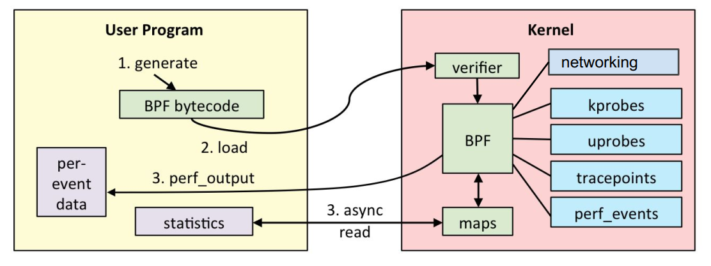
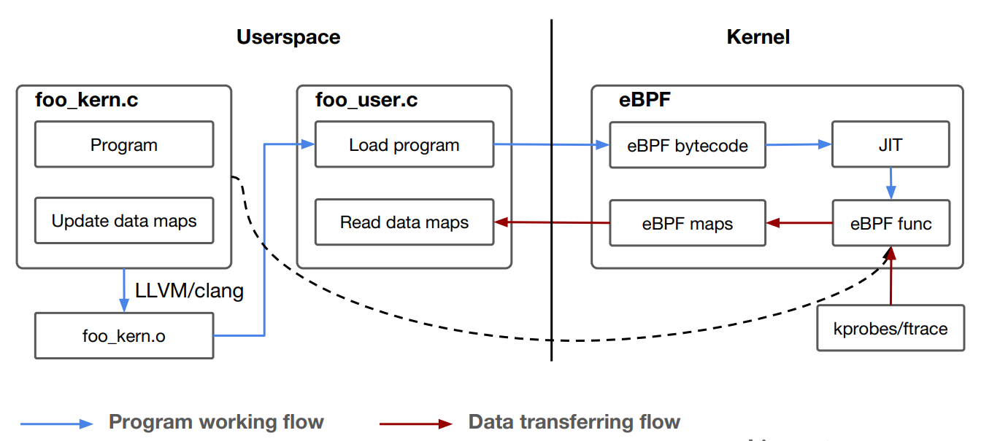
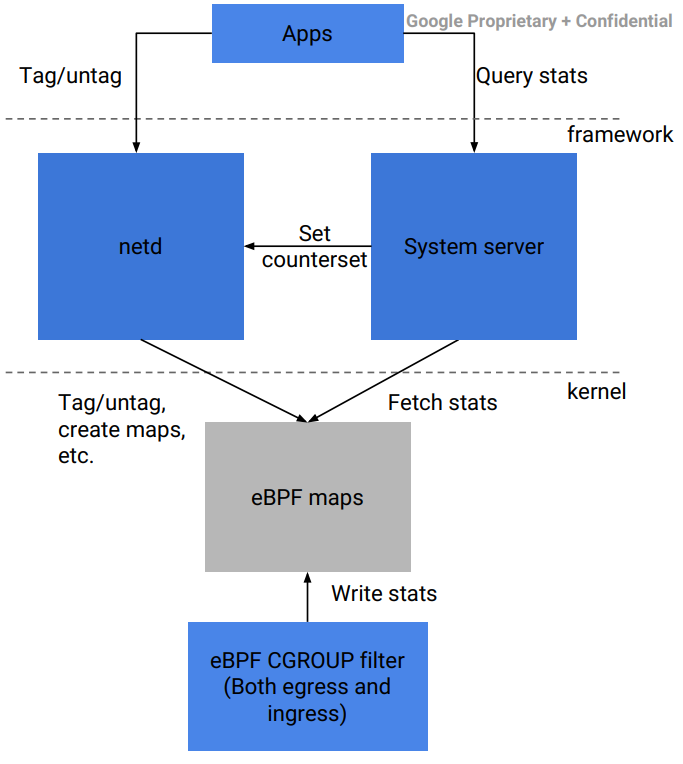
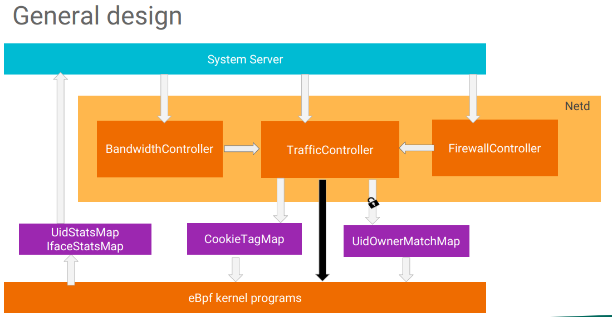

## 1. Linux hook 机制

### 1.1 是什么
* hook 机制是一种允许内核或模块在 **特定事件** 发生时插入 **自定义代码** 的机制
    * 这些事件可以包括 硬件中断，系统调用，网络数据包到达，文件操作 等
    * 在事件发生时，执行自定义的代码，从而实现 安全检查，网络数据包过滤，性能监控 等
* hook 机制主要通过以下几种方式实现
    * 软中断 (Softirqs)
        * 当一些事情发生时，内核会安排相应的软中断来处理这些事情
    * 系统调用 (System Calls)
        * 系统调用是 用户空间程序 与 内核 交互的接口
        * 内核为每个系统调用提供了一个函数指针表
        * 开发者可以通过替换这些函数指针来拦截系统调用，实现自定义逻辑
    * 网络钩子 (Netfilter Hooks)
        * Netfilter 是内核中的一个框架，用于在网络协议栈中注册 Hook 函数
        * 可以在网络数据包 经过网络协议栈的特定位置时 执行 自定义的处理函数
            * 包过滤，NAT 等
    * 字符设备和文件系统接口
        * 创建自定义的字符设备或文件系统，通过此，用户空间程序可以与内核通信
        * 可以在这些接口中实现自定义逻辑，从而实现内核事件的拦截和处理
    * 动态内核模块
        * 动态地向内核添加新功能或修改现有功能
        * 允许开发者在运行时拦截内核事件，并注入自定义的处理逻辑
    * **eBPF**

### 1.2 网络相关 eBPF hook
* XDP (eXpress Data Path) 和TC (Traffic Control) 是Linux内核中预置的hook机制
    * 允许开发者在网络数据包处理过程中插入自定义的逻辑

#### 1.2.1 XDP (eXpress Data Path)
* XDP 是一种高性能的网络数据包处理框架
* 它允许数据包 **到达网络接口的早期阶段** 执行自定义的 BPF 程序
    * 进入网络协议栈之前
* hook 点通常位于网络接口的 **输入路径**
    * 比如 **数据包到达网卡** 时

#### 1.2.2 TC (Traffic Control)
* 用于实现流量控制和 QoS
* 它允许在 **网络协议栈的不同层次上** 执行自定义的 BPF 程序，以控制数据包的传输
* hook 点通常位于网络协议栈的 **输出路径**
    * 比如 **数据包离开网卡** 时

### 1.3 其他内置 eBPF hook

#### 1.3.1 Tracepoints
* Tracepoints是Linux内核中内置的事件触发点
* 允许开发者在内核中的 **特定事件发生时** 执行eBPF程序
    * 这些事件可以是函数调用、网络数据包的到达、系统调用等

#### 1.3.2 Kprobes 和 Uprobes
* 允许开发者在内核和用户空间程序中的 **特定函数、代码行上** 插入eBPF程序
    * Kprobes用于内核函数
    * Uprobes用于用户空间程序

#### 1.3.3 **cgroup hook**
* cgroup (control group)
    * Linux 提供的一种机制，可以把进程组织成组，然后对 CPU，内存，IO，网络等资源进行限制或监控
* 从 Linux 4.10 开始，内核允许在 cgroup 的某些操作上挂载 eBPF 程序
    * 这样每次进程发起相关操作 (比如网络连接，发送包) 时，都会触发挂载的 eBPF 程序
* 常见的网络方向上的 cgroup hook 类型
    * `cgroup/connect4`、`cgroup/connect6`
        * 在进程通过 IPv4 / IPv6 发起 TCP 连接时触发
        * 可以用来实现 "某个 UID 是否允许访问网络"
    * `cgroup/sendmsg4`、`cgroup/sendmsg6`
        * 在进程通过 socket 发送数据时触发
        * 可以统计流量，甚至实现限速
    * `cgroup/recvmsg4`、`cgroup/recvmsg6`
        * 在进程接收数据时触发
        * 也可用来统计流量
    * `cgroup/sock`
        * 在创建 socket 时触发
        * 可以决定是否允许某进程创建 socket
    * **`cgroup/sock_addr`**
        * connect，sendmsg，recvmsg的新实现方式
        * 提供更通用的 socket 地址拦截点
        * **Android 12 (基于 5.4/5.10 内核)**：基本上全面使用`cgroup/sock_addr`作为默认方案


## 2. BPF

### 2.1 是什么
* BPF (Berkeley Packet Filter) 是一种灵活的，高性能的内核技术
* 它允许 在内核空间执行自定义的程序代码，以便实时分析和处理网络数据包
* BPF的一个重要应用是eBPF (extended BPF)
    * 它是Linux内核的一个扩展，引入了更多功能和安全性，允许用户编写更复杂的程序，并将它们加载到内核中
    * 被广泛用于网络和性能分析，还被用于容器、安全监控和其他系统级应用程序

### 2.2 基本工作原理




#### 2.2.1 生成
* 用户编写BPF程序，然后使用特定的工具（例如`clang`编译器和`llvm`的BPF后端）将其编译成BPF字节码

#### 2.2.2 加载
* 内核通过系统调用或特定接口 (例如`bpf()`系统调用) 加载BPF程序

#### 2.2.3 验证
* BPF程序在加载时会被内核验证，以确保它是安全的、不会导致系统崩溃或安全漏洞
* 内核会检查BPF程序的大小、执行路径是否有限制、循环次数等，以确保它在有限的资源内执行

#### 2.2.4 执行
* BPF程序是一种基于栈的虚拟机程序，**由一系列BPF指令组成**
    * 例如算术运算、逻辑运算、内存读写等
    * BPF程序的执行是逐条指令地进行的
* 当一个BPF程序被加载到内核中时，内核会为该程序分配一个BPF虚拟机实例
* BPF程序的执行 **通常发生在相关的钩子函数中**
    * 例如网络数据包的收发过程中

#### 2.2.5 输出
* per-event data
* BPF Maps
    * BPF Maps 是一种数据结构，它允许 BPF 程序与 用户空间程序 之间进行数据交换
    * BPF 程序可以读取和写入 BPF Maps，实现内核与用户空间之间的数据共享

### 2.3 示例

#### 2.3.1 per-event
1. 编写 eBPF 程序
    * 以下是一个简单的eBPF程序，用于过滤源IP地址为`10.0.0.1`的数据包

    ```C
    #include <linux/bpf.h>
    #include <linux/if_ether.h>
    #include <linux/ip.h>

    SEC("filter")
    int my_filter(struct __sk_buff *skb) {
        struct ethhdr *eth = bpf_hdr_pointer(skb, 0);
        struct iphdr *ip = (struct iphdr *)(eth + 1);

        if (ip->saddr == htonl(0x0a000001)) {
            return XDP_PASS;  // 允许包通过
        } else {
            return XDP_DROP;  // 丢弃包
        }
    }
    ```

2. 加载 eBPF 程序到内核
    * 使用`bpf()`系统调用或`libbpf`等库，将编译好的eBPF程序加载到内核中

    ```C
    int prog_fd = bpf_load_program(BPF_PROG_TYPE_XDP, program, sizeof(program), "GPL", 0, &error);
    if (prog_fd < 0) {
        fprintf(stderr, "Error loading BPF program: %s\n", strerror(-prog_fd));
        return 1;
    }
    ```

3. 在网络设备上附加 eBPF 程序
    * 使用ip命令或其他网络管理工具，在网络设备的钩子点（比如XDP或TC）上附加eBPF程序

    ```C
    ip link set dev eth0 xdp obj my_filter.o
    ```

#### 2.3.2 BPF Maps
* 使用BPF Maps在eBPF程序中统计特定端口的入站数据包数量和字节数

1. 创建 BPF Maps, 用于记录 **端口号** 到 **数据包数量和字节数** 的映射关系

    ```C
    struct bpf_map_def SEC("maps") port_stats = {
        .type = BPF_MAP_TYPE_HASH,
        .key_size = sizeof(uint16_t),
        .value_size = sizeof(struct {
            uint64_t packets;
            uint64_t bytes;
        }),
        .max_entries = 65536,
    };
    ```
    * key 是 端口号（`uint16_t`类型）
    * value 是 一个包含数据包数量和字节数的结构体

2. 编写一个eBPF程序，在数据包到达网络接口时，统计特定端口的数据包数量和字节数

    ```C
    SEC("filter")
    int count_packets(struct __sk_buff *skb) {
        uint16_t *port;
        struct {
            uint64_t packets;
            uint64_t bytes;
        } *stats;

        // 从数据包中提取目标端口号
        port = bpf_hdr_pointer(skb, 0);
        if (*port == htons(80)) {  // 统计端口80的数据包
            stats = bpf_map_lookup_elem(&port_stats, port);
            if (stats) {
                stats->packets++;
                stats->bytes += skb->len;
            } else {
                struct {
                    uint64_t packets;
                    uint64_t bytes;
                } new_stats = {1, skb->len};
                bpf_map_update_elem(&port_stats, port, &new_stats, BPF_ANY);
            }
        }

        return XDP_PASS;
    }
    ```
    * `bpf_map_lookup_elem`

        ```C
        void *bpf_map_lookup_elem(void *map, const void *key);
        ```
        * 该函数用于在给定的BPF Maps（`map`参数）中查找键为`key`的元素
            * 如果找到了，函数返回指向该元素的指针
            * 如果没找到，返回NULL
    * `bpf_map_update_elem`

        ```C
        int bpf_map_update_elem(void *map, const void *key, const void *value, uint64_t flags);
        ```
        * 该函数用于在给定的BPF映射（`map`参数）中更新或插入键为`key`的元素
            * 如果键已存在，函数将替换该元素的值
            * 如果键不存在，函数将插入一个新元素

3. 用户空间应用程序可以通过读取`port_stats`映射来获取统计信息

    ```C
    struct {
        uint64_t packets;
        uint64_t bytes;
    } stats;

    uint16_t port = htons(80);
    if (bpf_map_lookup_elem(port_stats_fd, &port, &stats) == 0) {
        printf("Port 80 stats: packets=%llu, bytes=%llu\n", stats.packets, stats.bytes);
    } else {
        printf("Port 80 not found in stats\n");
    }
    ```


## 3. Android 里 eBPF




### 3.1 编写

```C
SEC("cgroupskb/egress/stats")
int bpf_cgroup_egress(struct __sk_buff* skb) {}
```

#### 3.1.1 section 名
* `"cgroupskb/egress/stats"` 这个名字不是随便起的
* 它是 BPF section 名，表示这个函数会被编译成一个 `BPF_PROG_TYPE_CGROUP_SKB` 程序，并且可以 hook 到 `BPF_CGROUP_INET_EGRESS`

|**Section 名**|**内核 attach 类型**|**内核 ProgType**|**常见 pin 路径（bpfloader 创建）**|**功能说明**|
|-|-|-|-|-|
|`cgroupskb/ingress/stats`|`BPF_CGROUP_INET_INGRESS`|`BPF_PROG_TYPE_CGROUP_SKB`|`/sys/fs/bpf/netd/prog_netd_cgroupskb_ingress_stats`|skb 入站过滤/统计|
|`cgroupskb/egress/stats`|`BPF_CGROUP_INET_EGRESS`|`BPF_PROG_TYPE_CGROUP_SKB`|`/sys/fs/bpf/netd/prog_netd_cgroupskb_egress_stats`|skb 出站过滤/统计|
|`cgroupsock/inet_create`|`BPF_CGROUP_INET_SOCK_CREATE`|`BPF_PROG_TYPE_CGROUP_SOCK`|`/sys/fs/bpf/netd/prog_netd_cgroupsock_inet_create`|控制能否建 socket|

* 内核在 load 的时候会根据 section 来识别程序 attach 类型
    * 但是 section 名字只存在于 ELF 文件
    * `SEC("cgroupskb/egress/stats")` 只是告诉 loader（比如 libbpf、bpfloader）要加载到哪

#### 3.1.2 函数名
* `bpf_cgroup_egress`这个随便起
* 用于用户态通过 libbpf 查找程序
    * `bpf_object__find_program_by_name(obj, "bpf_cgroup_egress")`

### 3.2 编译
* `SEC("cgroupskb/egress/stats")` 会告诉 clang/LLVM：
    * 这个函数放在 ELF 的 section `"cgroupskb/egress/stats"`里
    * 编译器把 C 代码转成 eBPF bytecode
* 最终生成 `.o` 文件（ELF 格式），里面有两个重要东西：
    1. section`"cgroupskb/egress/stats"`
        * eBPF 程序本体
    2. 符号表
        * 记录函数名`bpf_cgroup_egress`，方便用户态查找
* 可以用 readelf 看一下

    ```Java
    DEFINE_BPF_PROG("cgroupskb/egress/stats", AID_ROOT, AID_ROOT, bpf_cgroup_egress)

    [ 5] cgroupskb/egress/ PROGBITS         0000000000000000  00000dc8
        0000000000000c80  0000000000000000  AX       0     0     8

    116: 0000000000000000  3200 FUNC    GLOBAL DEFAULT    5 bpf_cgroup_egress
    ```

### 3.3 加载
* 在 Android 里，系统启动时会跑 bpfloader，它做了 2 件事
    * 加载 ELF section 到内核
    * pin 到 BPF fs
* **注意，这里只是类似于代码编译好了，放进了内存，但还没有告诉系统 什么时候去执行它**

#### 3.3.1 加载 ELF section 到内核

```C
fd = bpf_prog_load(cs[i].type, name.c_str(), (struct bpf_insn*)cs[i].data.data(),
                            cs[i].data.size(), license.c_str(), kvers, 0, log_buf.data(),
                            log_buf.size());
```

  * 会把 ELF section `"cgroupskb/egress/stats"` 里的 bytecode 送进内核
  * 内核返回program fd
      * 这个 fd 只在当前进程有效，进程退出时 fd 会消失
      * 为了让程序在进程退出后依然存在，内核提供了一个 持久化 机制 bpffs

#### 3.3.2 pin 到 BPF fs

```
ret = bpf_obj_pin(fd, progPinLoc.c_str());
```
  * 这一步会在`/sys/fs/bpf/netd/`下生成一个文件节点
      * 文件内容不是普通二进制，而是 **内核中 eBPF 程序的句柄**
  * 任何用户态程序 open 这个路径就能拿到同一个 program fd
      * 这就是为什么 netd 里可以写

    ```C
    attachProgramToCgroup(BPF_EGRESS_PROG_PATH, cg_fd, BPF_CGROUP_INET_EGRESS)
    ```
      * 它只是 open`/sys/fs/bpf/netd/prog_netd_cgroupskb_egress_stats`得到 fd，然后 attach 到指定 cgroup


#### 3.3.3 具体代码

```C
BpfLoader::loadAllElfObjects
    android::bpf::loadProg
        Loader::loadProg
            readCodeSections
                // convert all slashes to underscores
                std::replace(name.begin(), name.end(), '/', '_');  <--- 注意这段
            loadCodeSections
                // Format of pin location is
                // /sys/fs/bpf/<prefix>prog_<filename>_<name>      <--- 注意这个 pin 文件名字
                bpf_prog_load
                bpf_obj_pin
```

### 3.4 Attach
* **把一个已经 load 的 eBPF 程序 绑定 到某个内核 hook 点**
    * cgroup hook
        * `bpf(BPF_PROG_ATTACH, ...)`
    * TC hook
        * `tc qdisc add … bpf da obj …`
    * XDP hook
        * `xdp_loader …`
* **当事件发生时，内核会调用你 attach 的 BPF 程序**
    * 就像把一个函数指针注册到了内核的某个事件回调列表

    ```C
    TrafficController::initPrograms
        unique_fd cg_fd(open(cg2_path.c_str(), O_DIRECTORY | O_RDONLY | O_CLOEXEC));
        attachProgramToCgroup(BPF_EGRESS_PROG_PATH, cg_fd, BPF_CGROUP_INET_EGRESS)
            unique_fd cgroupProg(retrieveProgram(programPath));
                bpfFdGet(pathname, BPF_F_RDONLY);
            android::bpf::attachProgram
                bpf(BPF_PROG_ATTACH, {
                                            .target_fd = BPF_FD_TO_U32(cg_fd),
                                            .attach_bpf_fd = BPF_FD_TO_U32(prog_fd),
                                            .attach_type = type,
                                    });
    ```

### 3.5 触发
* 当进程执行 **`BPF_CGROUP_RUN_PROG_INET_EGRESS(sk, skb);`** 时触发 eBP

### 3.6 总结
|**阶段**|**名称/路径**|**内容**|
|-|-|-|
|编写|`bpf_cgroup_egress`+`SEC("cgroupskb/egress/stats")`|C 代码 + section 标记|
|编译|ELF文件|section`"cgroupskb/egress/stats"`，函数符号表|
|加载|`bpfloader`|`bpf_object__load()` → 内核 program fd|
|Pin|`/sys/fs/bpf/netd/prog_netd_cgroupskb_egress_stats`|内核 program fd 对应的文件节点|
|attach|`attachProgramToCgroup(path, cg_fd, BPF_CGROUP_INET_EGRESS)`|用户态 open path → fd → attach 到 cgroup hook|
